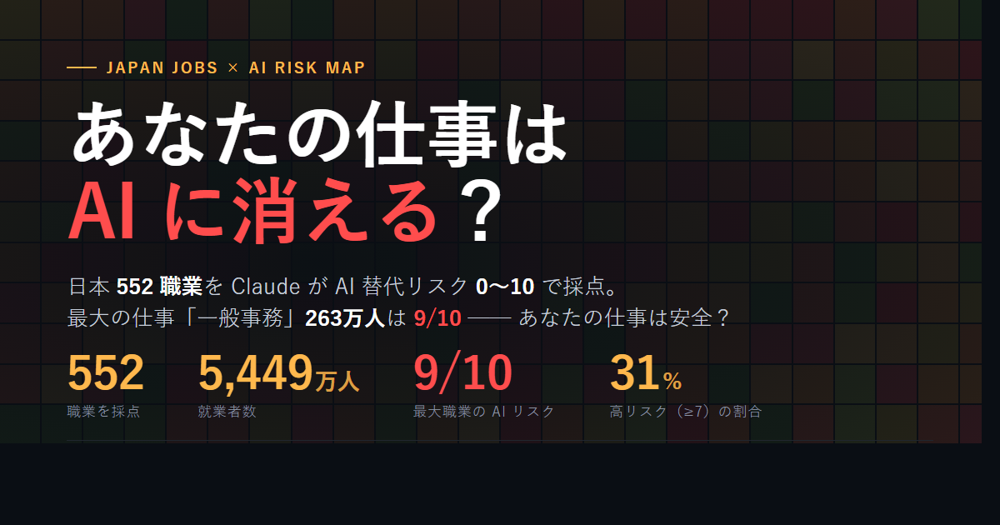

# Japan Jobs × AI Risk

[](https://mirai-shigoto.com/)
[](LICENSE)
[-000)](https://vercel.com)

> **🌏 [English README is here](README.md)**



厚生労働省の **職業情報提供サイト（job tag）** に登録されている **552 の日本の職業** について、年収・学歴・就業者数・将来性などの構造化データに加えて、**LLM が 0〜10 で採点した AI 代替リスクスコア** とその理由を重ねた可視化サイトです。UI は日本語で、国内の読者を対象としています。

🔗 **公開サイト:** **<https://mirai-shigoto.com/>**

---

## このサイトの位置づけ

ひとつの squarified treemap で、**どの職業が AI による代替の影響を受けやすいか** を、就業者数の重み付き視点で一目で見られるように設計されています。

データの土台は、公開されている日本政府統計（job tag、労働力調査、経済センサス）です。リスクスコアは別途 LLM が生成しており、調査結果ではなく **モデル出力であることを明記** しています。UI は日本語で、国内の読者を対象としています。

本プロジェクトは **厚生労働省、独立行政法人 労働政策研究・研修機構（JILPT）、その他いかなる政府機関とも提携していません**。独立した分析です。

---

## サイトでできること

[mirai-shigoto.com](https://mirai-shigoto.com/) を開くと、以下が見られます：

- **552 職業の treemap**。タイルの **大きさ** は就業者数、**色** は AI 代替リスク（既定）。大きい赤いタイル = 多くの人が従事しており、AI 露出も高い職業。大きい緑のタイル = 多くの人が従事しており、AI 露出は低い職業。
- **6 種類の色レイヤー** をツールバーから切替可能：AI リスク / 年収 / 平均年齢 / 労働時間 / 求人倍率 / 学歴。タイルの大きさは変わらず、色の意味だけが変わります。
- **色覚配慮（viridis）** トグル。
- **Direction C ウォームエディトリアル・テーマ** — 暖米色パレット、Noto Serif JP 見出し、テラコッタのアクセント。`prefers-color-scheme` による検出は組み込み済み、手動ライト/ダーク切替トグルは現在非表示。
- **職業名でリアルタイム検索**。
- **タイルにマウスオーバー（PC）またはタップ（スマホ）** で tooltip — リスクスコア、年収、就業者数、LLM の評価理由を表示。
- **556 職業の専用詳細ページ** — `/ja/<id>.html`（552 + 声優・ブロックチェーン・エンジニア・産業医・3D プリンター技術者の 4 新規職業）、各ページに評価理由のフルテキスト、5 軸プロファイルレーダー、年収 / 平均年齢 / 労働時間 / 求人倍率 / 学歴の内訳、転職パス推薦、検索エンジン向けの構造化データ（Schema.org `Occupation` JSON-LD）を含む。
- **17 のセクターハブページ** — `/ja/sectors/` に 16 業種の一覧インデックスと各業種専用ハブ。各ハブは AI 影響 TOP 5（高/低）、就業者数 TOP 5、全職業ソート一覧を集約。
- **専用ページ** — データについて（`/about`）、コンプライアンス（`/compliance`）、プライバシー（`/privacy`）、カスタム 404。
- **ソーシャル共有ボタン** — X、LINE、Hatena Bookmark、LinkedIn、Copy Link、モバイルでは Web Share API。
- **クッキーレス解析レイヤー** を Google Analytics と並走。クッキーを許可していなくても主要な集計は機能します。

UI は 360 px のスマートフォンと 4K デスクトップの両方で同じコンテンツ密度で読めるよう設計しています。

---

## なぜこのサイトを作ったか

2024 年に Andrej Karpathy 氏が公開した [karpathy/jobs](https://github.com/karpathy/jobs) は、米国労働統計局の Occupational Outlook Handbook（342 職業）を題材に、各職業に対して LLM が AI 代替リスクを 0〜10 で採点した可視化作品でした。きれいな構造でした — 実在する BLS の職業、実在する BLS の就業者数、その上に LLM が生成したリスクスコアという 1 層だけが合成データ。

中国でフォークされた [madeye/jobs](https://github.com/madeye/jobs) は同じフォーマットを採用したものの、土台を変えてしまいました — 職業リスト自体が AI 生成だったのです。これでは出所をたどる連鎖が切れ、数字が公的データに接地しません。

日本にも BLS OOH に相当する公的データが存在します — **厚生労働省 職業情報提供サイト（job tag）**、約 500 職業、年収・学歴・就業者数・将来性などが構造化された形で提供されています。このデータセットは数年前から存在していたにもかかわらず、Karpathy 流の treatment（政府データに基づき、LLM スコア付き）を施したものは **誰も作っていませんでした**。

本プロジェクトはその欠けていたピースです。Karpathy のアイデアを日本に移植したものです。

---

## AI 代替リスクスコアの算出方法

ここはこの可視化作品で **最も重要かつ、最も議論の余地がある** 部分なので、紙面を割いて説明します。

### 0〜10 のスケール

各職業に **AI 代替リスクスコアとして 0（影響ほぼなし）〜 10（短期的に大きな代替圧）の整数** を 1 つ付与しています。スコアは次の問いに答えるものです：*「この職業の日々の業務のうち、現時点のフロンティアレベルの LLM（ツール、エージェント、合理的な統合を含む）が、典型的な日本の職場に投入された場合、どの程度こなせそうか？」*

両端のアンカー：

- **0〜2（低）** — 物理的・身体的、あるいは信頼が前提となり自動化が困難・社会的に受け入れられにくい仕事：看護師、介護職員、電気工事士、潜水士、保育士。
- **3〜4（やや低）** — 監督、現場作業、関係性の比重が高く、AI が支援はしても代替しにくい役割：料理人、整備士、学校教員。
- **5〜6（中）** — 知識労働だが AI が一部分を担い、人間が主導するケース：営業職、人事、中堅デザイナー、パラリーガル。
- **7〜8（高）** — テキスト・分析中心の事務職で、認知的負荷の大半を AI がすでにこなせる：一般事務、経理、翻訳、ジュニアコピーライター。
- **9〜10（最高）** — 構造化テキスト入 → 構造化テキスト出、純粋な情報処理が支配的な職務：一般事務、データ入力、銀行窓口の定型業務、簡易テンプレート編集。

これらのアンカーは **Karpathy の公開ルーブリックを移植** し、日本特有の例に置き換えたものです。意図は、Karpathy が米国の職業に当てているのと同じ 0〜10 のスケールを、なじみのある日本の職業名と並べて読めるようにすることです。

### スコアが生成される流れ

スコアリングは `scripts/make_prompt.py` でビルドしたプロンプトバンドルを Claude Code セッションに渡して実行します。各職業について：

1. **入力バンドル** — 職業名（日 + 英）、業種、job tag の「仕事内容」記述、構造化フィールド（年収、就業者数、学歴分布、将来性）。
2. **プロンプト** — 上記のキャリブレーションアンカー + 入力バンドル + 構造化出力指示（JSON: `score: int`, `rationale_ja: str`, `rationale_en: str`）。
3. **モデル** — [OpenRouter](https://openrouter.ai) 経由で既定は Gemini Flash。設定可能で、Claude Sonnet や GPT-4o への切替は config 1 行。
4. **出力** — モデルのスコア + 理由文、職業ごとにキャッシュ。再実行時は既出力の職業はスキップ。
5. **集約** — `scripts/build_data.py` が IPD ソースデータ + AI スコア + 翻訳 + 統計を結合し、`dist/` 下に 9 つの projection family を出力（treemap / detail / search / labels）。フロントエンドは `dist/data.treemap.json` を読み込みます。

各理由文は 1〜3 文で、*なぜそのスコアになったか* — 業務のどの部分が現時点の LLM でこなせそうか、どの部分が難しそうか — を簡潔に説明します。

### 限界 — このスコアは何で、何ではないか

このスコアは **「現在のフロンティア LLM がこの職業について構造化された意見を述べたもの」** であり、**ground truth ではない** とご理解ください。具体的には：

- **モデル出力であって、調査統計ではありません。** 就業者数や年収中央値は実在の統計値です。リスクスコアは、軽く構造化された生成テキストです。
- **プロンプトの言い回しに敏感です。** ルーブリックを変える、アンカーを変える、あるいは worked example の言い方を変えるだけで、データセット全体で 1〜2 ポイントずれることがあります。公開しているアンカーとプロンプトは安定したものですが、それは可能なキャリブレーションのひとつであり、唯一解ではありません。
- **「現時点の LLM の見解」を反映しており、その見解は変動します。** 新しいモデルで再採点するとスコアが動きます。古いモデルはクリエイティブ職に対して系統的に悲観的、新しいモデルは事務職に対して悲観的、という傾向もあります。スコアはスナップショットです。
- **日英の理由文は乖離しうる。** 同一の呼び出し・同一の context から生成されますが、モデルが言語ごとに強調する側面を変えることが時々あります。なお、英語の理由文はソースデータに保持されていますが、サイト上には表示されません（EN UI は v1.4.0 で廃止）。
- **face validity 以上の妥当性は主張しません。** 実務者へのフォローアップ調査も、実際の代替率との比較も、信頼区間もありません。将来の安定版では複数 LLM のクロス整合性チェックを追加する予定ですが、現バージョンには含まれていません。

このダッシュボードは、すでに発表されている学術的演習を日本の読者にとって具体的・クリック可能な形で提示するためのものです。**特定の個人の仕事の将来を予測する目的では作っていません。**

---

## データソース

| 出典 | 用途 | URL |
| --- | --- | --- |
| 厚生労働省 職業情報提供サイト（job tag） | 主要データ：職業名、年収、学歴分布、就業者数、将来性、仕事内容記述 | <https://shigoto.mhlw.go.jp/User/> |
| 総務省 労働力調査 | 就業者数の補正および産業横断検証 | <https://www.stat.go.jp/data/roudou/> |
| 総務省 経済センサス | 事業所単位の産業分布 | <https://www.stat.go.jp/data/e-census/> |

すべて公開されている政府統計です。本サイトはこれらの生データを再公開するものではありません — 職業ごとの構造化フィールドを取り込み、その上に LLM 生成スコアを重ねて提示するだけです。

---

## ビルドパイプライン

Python ビルドパイプライン（[uv](https://docs.astral.sh/uv/) が必要）が MHLW jobtag の政府公開データを取り込み、LLM が生成した AI 代替リスクスコアと結合し、Pydantic で検証した上で、Vercel が配信する静的アセットを出力します。スクリプトは `scripts/` にあり、増分キャッシュ済み — 再実行時は出力済みの作業をスキップします。詳細は [`scripts/README.md`](scripts/README.md) を参照。

---

## 本番環境スタック

| レイヤー | 内容 |
| --- | --- |
| ホスティング | Vercel（Tokyo edge）— `main` から自動デプロイ |
| ドメイン | `mirai-shigoto.com`（Cloudflare Registrar → Vercel） |
| メール | Resend via Edge Function（`api/subscribe.js`、`api/feedback.js`） |
| アナリティクス | Cloudflare WA、GA4、Vercel WA、Vercel Speed Insights（[仕様](analytics/spec.yaml)） |
| SEO | `robots.txt`、`sitemap.xml`、[`/llms.txt`](https://mirai-shigoto.com/llms.txt)、Schema.org 構造化データ |

---

## 免責事項

> **本サイトは非公式サイトです / This site is unofficial.**
>
> 独立した分析です。**厚生労働省、独立行政法人 労働政策研究・研修機構（JILPT）、総務省、または job tag そのものとは提携・後援関係はなく、その公式見解を示すものでもありません。**
>
> AI 代替リスクスコアは **モデル出力** であり、調査統計ではありません。公開ルーブリックに照らして大規模言語モデルが生成したものであり、特定個人のキャリア予測ではなく、モデルの構造化された意見として読まれるべきものです。詳しい限界は [算出方法](#ai-代替リスクスコアの算出方法) を参照してください。
>
> 就業者数、年収中央値、年齢分布、学歴分布は公開されている日本政府統計に由来しますが、本サイトはそれらを非権威的な形（一次出版物ではなく可視化）で提示しています。意思決定にあたっては必ず公式情報源をご確認ください。

---

## ディレクトリ構成

```text
jobs/
├── index.html              # treemap フロントエンド（Vercel が配信）
├── privacy.html            # プライバシーポリシー
├── ja/<id>.html            # 職業詳細ページ
├── ja/sectors/<slug>.html  # セクターハブページ
├── api/                    # Vercel Edge Function（OG 画像、登録、フィードバック）
├── analytics/              # GA4 計測スペック + 同期スクリプト
├── data/                   # ソースデータ（職業別 JSON、スコア、ラベル）
├── dist/                   # ビルド済み投影（treemap、detail、search、labels）
├── scripts/                # Python ビルドパイプライン
├── vercel.json             # 静的サイト設定
├── CHANGELOG.md            # リリース履歴
└── README.md / README.ja.md
```

---

## 引用フォーマット

本サイトを文章で引用される場合は、以下のフォーマットをご利用ください。

### 文中（記事・ブログ・SNS）

> *出典：Japan Jobs × AI Risk（mirai-shigoto.com）— 厚労省 job tag のデータに LLM 生成の AI 代替リスクスコアを重ねた独立可視化サイト。就業者数等は厚労省の公開データ、リスクスコアはモデル出力であり統計値ではない。*

### APA

> Mirai Shigoto. (2026). *Japan Jobs × AI Risk: A visualization of 552 Japanese occupations with LLM-scored AI replacement risk* [Web visualization]. <https://mirai-shigoto.com/>

### BibTeX

```bibtex
@misc{japan_jobs_ai_risk,
  author       = {{Mirai Shigoto}},
  title        = {Japan Jobs × AI Risk: A visualization of 552 Japanese occupations with LLM-scored AI replacement risk},
  year         = {2026},
  howpublished = {\url{https://mirai-shigoto.com/}},
  note         = {Workforce data from MHLW jobtag; AI risk scores are LLM-generated and not survey statistics. Source code: \url{https://github.com/jasonhnd/jobs}}
}
```

### Schema.org Dataset（機械可読）

ホームの `<head>` 内に `Dataset` 型の JSON-LD を埋め込み、`variableMeasured` / `creator` / `license` / `isBasedOn`（厚労省の一次データへの参照）を記述しています。検索エンジンや LLM は自動で拾ってくれるので、利用者側で別途書き起こす必要はありません。

**データセットを引用する** 場合は、就業者数 / 年収 / 学歴などの数値については 厚生労働省（job tag）を、AI リスクスコア + 提示レイヤーについて本プロジェクトをクレジットしていただければと思います。

---

## コントリビュート

GitHub Issues と Pull Request を歓迎します：

- **Issues** — 手法に関する質問、データソースの提案、キャリブレーションへのフィードバック（「職業 X のスコアはおかしい — その理由は…」）。
- **PR** — バグ修正、新しい色レイヤー、アクセシビリティ改善。
- **スコアへの異議** — 特定職業のスコアが大きく間違っていると感じた場合は、Issue で：職業名、現在のスコア、提案するスコア、*理由*（モデルが過大 or 過小評価していると思う業務内容）を添えてください。バッチでレビューします。

---

## ライセンス

[MIT](LICENSE) © 2026 mirai-shigoto.com

MIT ライセンスは本リポジトリ内のソースコードに適用されます。土台となる厚労省 job tag のデータは厚生労働省が独自の利用条件で公開しています — 一次データの利用条件は <https://shigoto.mhlw.go.jp/User/> をご確認ください。

---

## 謝辞

- **[karpathy/jobs](https://github.com/karpathy/jobs)** — 本プロジェクトが日本向けに移植している、BLS OOH × LLM スコアリングのオリジナルテンプレート。
- **厚生労働省 職業情報提供サイト（job tag）** および **総務省 統計局** — 構造化された職業データ・労働力データを公開し、第三者がその上に積み上げられる形にしてくださっていること。
- **独立行政法人 労働政策研究・研修機構（JILPT）** — job tag が参照している土台の「職業情報データベース」を整備していること。
- **[OpenRouter](https://openrouter.ai)** — 複数モデル提供者にまたがるバッチスコアリングを現実的にする統一 LLM API。
- **Vercel、Cloudflare、Resend** — 一人開発のサイドプロジェクトでも国内訪問者に 50 ms 以下のレイテンシを提供できるインフラ。

---

## 関連ドキュメント

README は *このサイトが何であるか* を説明します。以下のファイルは *どう動いているかの詳細* を扱い、プロジェクト進化に合わせて随時更新されます：

- **[CHANGELOG.md](CHANGELOG.md)** — リリース履歴。リリースごとに更新される唯一のドキュメント。
- **[`analytics/spec.yaml`](analytics/spec.yaml)** — GA4 計測仕様：すべてのイベント、パラメータ、ディメンション、キーイベント。
- **[`/privacy`](https://mirai-shigoto.com/privacy)** — プライバシーポリシー（APPI + GDPR 対応）。
- **[`/llms.txt`](https://mirai-shigoto.com/llms.txt)** — AI 検索エンジンが本サイトを索引付けする際に見るドキュメント。
- **[`scripts/README.md`](scripts/README.md)** — パイプラインの実行順序とスクリプトごとのフラグ。
